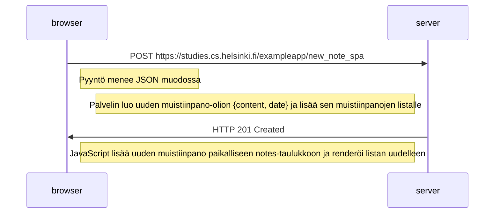

```mermaid
    sequenceDiagram
    participant browser
    participant server

    browser->>server: POST https://studies.cs.helsinki.fi/exampleapp/new_note_spa
      Note right of browser: Pyyntö menee JSON muodossa
     Note left of server: Palvelin luo uuden muistiinpano-olion {content, date} ja lisää sen muistiinpanojen listalle
    server->>browser: HTTP 201 Created
    Note right of browser: JavaScript lisää uuden muistiinpano paikalliseen notes-taulukkoon ja renderöi listan uudelleen
```
